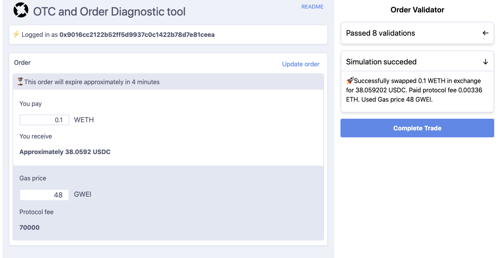
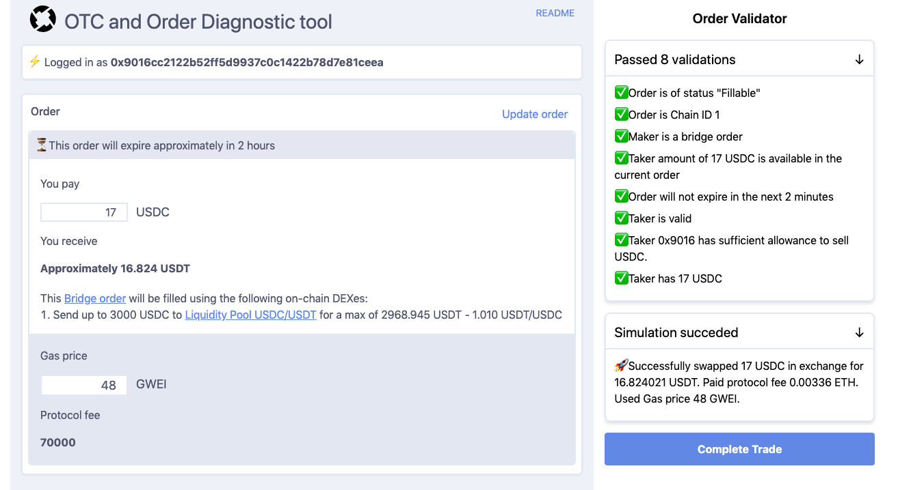
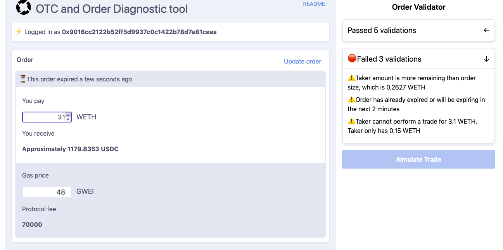

# 0x Doc

0x Doc was created to serve technically-savvy users such as market-makers, 0x API integrators, and RFQ providers that want experiment, simulate, and trade 0x V3 orders. 0x Doc provides a simple user interface and allows them to gain more insight from the on-chain magic that happens in 0x.


### Links
- [0x Doc](http://0xdoc.xyz/)
- [0x Protocol](http://0x.org/)
- [The developer and maintainer](https://twitter.com/pirosb3)
- [The designer](https://www.linkedin.com/in/danniphu)

## Screenshots

### A successful Open Orderbook swap simulation Between WETH and USDC



### A successful Bridge order swap Between USDC and USDT



### Order is unable to be filled due to multiple errors




## How does it work?

Paste in a 0x V3 Signed Order and click "Select this order".  The “doc” will provide a detailed human explanation of the order, allow you to select how much of the order you want to take, simulate the trade using the blockchain, and ultimately sign and broadcast the transaction on-chain.

## Who is this tool for?

This can be useful for market makers (RFQ and Open Orderbook) that want to test their hedging functionality, it can provide validation to new 0x makers that their backends are working (allowing them to test cancellations, and order signatures), and it can allow the 0x Protocol team to test `DexForwarderBridge` orders.
Even if 0xDoc is tailored to advanced users, this feature can also be used for OTC-style trading: a taker can simulate an OTC-style trade and read the exact amount and rate they are going to receive before finalizing their trade.

## 🔗 Order linking

Did you know that you can send a custom 0x order encoed in a 0x Doc URL? this allows developers and OTC traders to easily share 0x orders via links. Simply encode the JSON order as base64 and add it to the URL:

```typescript
`https://0xdoc.xyz?order=${btoa(JSON.stringify(signedOrder))}`
```

## FAQ

### What tokens do you support?

I support the same tokens that [the 0x API does](https://api.0x.org/swap/v0/tokens). However, 0x Doc is not smart enough to read this token registry from the API and uses as internal JSON copy of available tokens. If a token is eligible in Matcha but is not eligible in 0x Doc, let me know and I will refresh the list.


### Who maintains this project?
This project is not endorsed or maintained by 0x. This is developed in my spare time, feel free to add feature reqeusts as GitHub issues and I'll prioritize it whenever possible.
